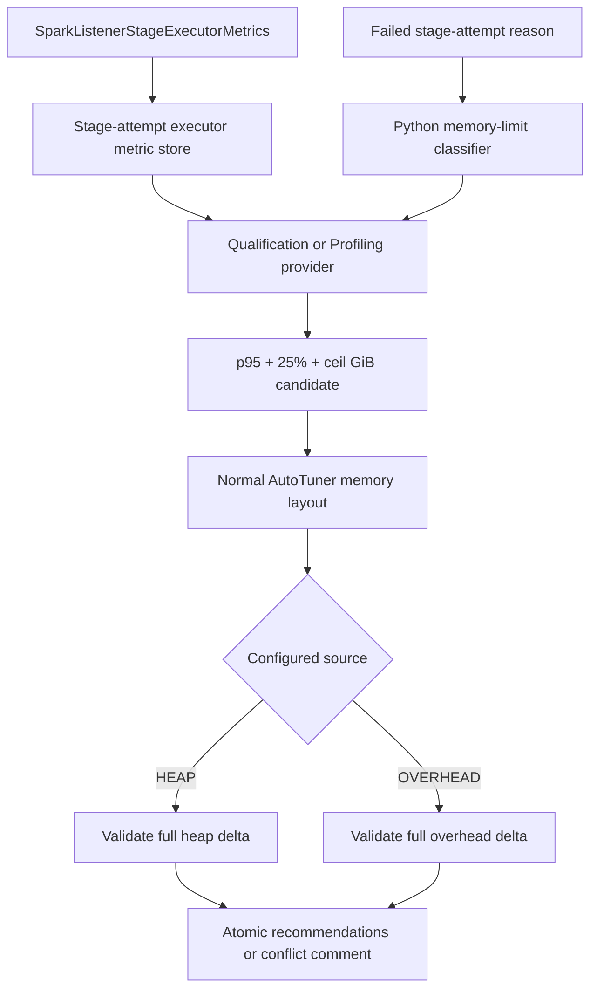

<!-- Copyright (c) 2026, NVIDIA CORPORATION. -->

# Evidence-driven PySpark memory autotuning - Plan

## Goal Capsule

- **Objective:** Recommend `spark.executor.pyspark.memory` after a failed Python memory-limited stage by using stage executor telemetry, then rebalance the increase from executor heap or overhead without increasing the executor memory budget.
- **Authority:** The failure evidence, formula, and source policy in this plan are fixed. The implementer owns internal class boundaries and naming that preserve these contracts.
- **Stop conditions:** Both Qualification and Profiling can retain and evaluate the evidence, the default `HEAP` policy produces an atomic safe recommendation, conflicts produce no partial memory change, and focused, full-core, and supported Spark-version tests pass.
- **Execution profile:** Create and use a dedicated worktree under `.worktrees/tools-2121` from `dev` on branch `tools-2121`. Keep all implementation and verification in that worktree.
- **Tail ownership:** The implementation PR owns parser storage, AutoTuner behavior, configuration, output definitions, regression tests, and concise user-facing conflict comments. It does not own Aether orchestration.

---

## Product Contract

### Summary

AutoTuner will use `ProcessTreePythonVMemory` from `SparkListenerStageExecutorMetrics` when a matching failed stage attempt reports a Python `MemoryError` or equivalent Python worker memory-limit signature. It will derive a larger PySpark allocation from those measurements and fund the increase from one configured memory pool. The default source is executor heap so RAPIDS overhead remains available for pinned memory, spill fallback, native allocations, and container headroom.

### Problem Frame

A fixed PySpark default cannot distinguish workloads. The CI23 job 202 replay failed with `spark.executor.pyspark.memory=4g`, while Python virtual memory peaked near 5.5 GiB. Spark enforces this setting through Python worker address-space limits, so virtual memory is the relevant signal. The same replay supports a 7 GiB recommendation after 25% headroom and GiB rounding.

AutoTuner already includes PySpark memory in its executor budget, but it does not recommend the property. It also intentionally assigns remaining executor capacity to memory overhead. A PySpark heuristic must therefore rebalance an already-sized memory layout; otherwise a heap reduction can be absorbed back into overhead and leave no room for the PySpark increase.

### Requirements

**Evidence and eligibility**

- R1. Retain `SparkListenerStageExecutorMetrics` for Qualification and Profiling by stage ID, stage attempt ID, and executor ID.
- R2. Classify a failed stage attempt as eligible only when its stage failure reason contains a Spark `PythonException` wrapper and a standalone allowlisted Python allocation exception token: `MemoryError`, `numpy.core._exceptions._ArrayMemoryError`, or `pyarrow.lib.ArrowMemoryError`. A positive source-application `spark.executor.pyspark.memory` is required for every numeric recommendation. Positive non-driver `ProcessTreePythonVMemory` samples select the evidence path; otherwise the same eligible failure selects telemetry guidance.
- R3. Match failure evidence and metrics by both stage ID and stage attempt ID; do not mix successful retries or unrelated attempts.
- R4. Treat the retained values as per-executor stage peaks. Exclude the driver and ignore missing, zero, or negative values.
- R19. When a matching Python memory-limit failure has no eligible samples, emit guidance to rerun with `spark.executor.processTreeMetrics.enabled=true`, `spark.eventLog.logStageExecutorMetrics=true`, and `spark.executor.metrics.pollingInterval=5000` instead of failing silently.
- R21. When R19 applies and the current PySpark memory setting is positive, recommend a telemetry-enabled retry of `ceil_to_1g(current * PYSPARK_MEMORY_RETRY_GROWTH_FACTOR)`, defaulting the growth factor to `1.5`. If the current setting is absent or zero, emit only telemetry guidance unless a separate minimum is introduced later.

**Recommendation math**

- R5. Compute nearest-rank p95 over all eligible executor peaks from all matching failed stage attempts, using rank `ceil(0.95 * n)` in ascending order.
- R6. Let `observedCurrent` be the positive source-application PySpark limit and compute `candidate = ceil_to_1g(PYSPARK_MEMORY_EVIDENCE_HEADROOM_MULTIPLIER * p95)` with overflow-safe byte arithmetic. The desired target is `max(observedCurrent, candidate)`. Let `layoutCurrent` be the PySpark value in the base target layout after preserved/enforced precedence; recommend only when the desired target is greater than `layoutCurrent`, using `delta = desiredTarget - layoutCurrent` for the atomic transfer. If `observedCurrent` is absent or zero, emit telemetry guidance only even when metrics exist.
- R20. Read the evidence headroom from `PYSPARK_MEMORY_EVIDENCE_HEADROOM_MULTIPLIER`, defaulting to `1.25`, rather than hard-coding it.
- R7. Do not apply a universal absolute cap such as 8 GiB. Bound the recommendation through the selected source capacity and the existing target-cluster executor memory budget.
- R8. Use virtual memory only for the PySpark address-space recommendation. Do not use it to increase physical executor, container, node, or memory-overhead sizing.

**Memory rebalance**

- R9. Add `PYSPARK_MEMORY_REBALANCE_SOURCE` with allowed values `HEAP` and `OVERHEAD`; default it to `HEAP` and reject invalid values.
- R10. Apply the PySpark delta as an atomic transfer from only the selected source after the normal AutoTuner memory layout has been calculated.
- R11. With `HEAP`, reduce `spark.executor.memory` by the full delta and leave the calculated overhead unchanged. Compute the transfer floor independently of the normally calculated, enforced, or preserved source-heap baseline as `HEAP_PER_CORE.min * executor cores`, and do not reduce heap below that floor. Enforced heap remains immovable; the normal heap recommendation and slack in a larger preserved heap can fund PySpark.
- R12. With `OVERHEAD`, leave heap unchanged and reduce overhead by the full delta only when the result retains the existing RAPIDS-safe overhead floor, including pinned, spill, JVM/native, off-heap-limit, and shuffle headroom requirements. Because AutoTuner currently emits `spark.executor.memoryOverhead` only for YARN and Kubernetes, selecting `OVERHEAD` on another master is a source-capability conflict and emits no coordinated recommendation.
- R13. Never fall back to the other pool. If the selected source cannot supply the full delta, emit no PySpark or source-pool change.
- R14. Preserve the invariant `heap + PySpark + Spark off-heap + overhead = base calculated executor allocation` for every successful rebalance.

**Overrides and output**

- R15. Treat target-cluster `enforced` values as immovable. A conflict on the PySpark target or selected source blocks the coordinated recommendation.
- R16. Allow a preserved PySpark target or selected source to change only when this heuristic fires; ordinary preserve behavior remains unchanged for every other recommendation.
- R17. On conflict, report observed current, layout current, candidate PySpark value, required delta, selected source, available delta, and the enforced, arithmetic, source-capability, or capacity constraint. Do not emit a partial pair.
- R18. Render `spark.executor.pyspark.memory` as a cluster-level byte setting in both supported AutoTuner output paths, including Qualification bootstrap output.

### Acceptance Examples

- AE1. **Covers:** R5-R7, R10-R11, R14. **Given** p95 Python virtual memory of 5.5 GiB, current PySpark memory of 4 GiB, base heap of 32 GiB, and sufficient heap capacity, **when** the default policy runs, **then** the output recommends PySpark 7 GiB and heap 29 GiB while overhead and total executor allocation remain unchanged.
- AE2. **Covers:** R9-R14. **Given** the same 3 GiB delta and `OVERHEAD`, **when** overhead has at least 3 GiB above its protected floor, **then** heap is unchanged and overhead is reduced by 3 GiB.
- AE3. **Covers:** R13, R15, R17. **Given** `HEAP` and an enforced heap value or less than the full delta available above the heap floor, **when** the heuristic runs, **then** it does not use overhead and emits no PySpark/heap pair.
- AE4. **Covers:** R2-R4. **Given** executor metrics without a matching Python memory-limit failure, a Java `OutOfMemoryError`, driver-only values, or metrics for another stage attempt, **when** AutoTuner runs, **then** it emits no PySpark recommendation.
- AE5. **Covers:** R7. **Given** evidence that produces a candidate above 8 GiB and enough selected-source capacity, **when** AutoTuner runs, **then** it can recommend that value because no universal 8 GiB cap applies.
- AE6. **Covers:** R19, R21. **Given** a matching Python memory-limit failure, no eligible telemetry, and current PySpark memory of 4 GiB, **when** AutoTuner runs, **then** it recommends a capacity-validated 6 GiB telemetry-enabled retry and reports all three required metric properties.
- AE7. **Covers:** R2, R6, R19, R21. **Given** a matching failure with or without eligible metrics and an absent or zero source PySpark limit, **when** AutoTuner runs, **then** it emits telemetry guidance only and no numeric PySpark or source-pool recommendation.
- AE8. **Covers:** R10-R17, R19, R21. **Given** a 4 GiB current limit and missing telemetry, **when** the 6 GiB retry target is evaluated, **then** the same atomic transfer, source-capacity, master-capability, preserve, and enforced conflict rules used for evidence-derived candidates apply.

### Scope Boundaries

- **In scope:** Core event parsing and retention, Qualification and Profiling provider signals, Python memory-failure classification, candidate math, memory-layout rebalancing, tuning configuration, output metadata, comments, and Scala tests.
- **Deferred:** A configurable percentile, rounding quantum, retry minimum for an unset current value, or operator-defined absolute cap. These can be added after production evidence shows a need.
- **Outside scope:** Aether job submission or retry policy, standalone CSV parsers, automatic target-cluster resizing, general executor-memory telemetry heuristics, and RSS-based physical sizing changes.

---

## Planning Contract

### Key Technical Decisions

- KTD1. Use `ProcessTreePythonVMemory`, not Python RSS, because `spark.executor.pyspark.memory` is enforced as a Python worker address-space limit. (session-settled: user-directed — chosen over RSS: the observed 5.5 GiB virtual-memory peak matches the memory-limit failure while RSS does not.) Governs R2-R8.
- KTD2. Use a configurable evidence headroom multiplier defaulting to 1.25, nearest-rank p95, and upward GiB rounding with no absolute 8 GiB cap. (session-settled: user-directed — chosen over a fixed 4 GiB default and universal 8 GiB cap: the recommendation must follow observed demand and target capacity.) Governs R5-R7, R20.
- KTD3. Rebalance after normal memory sizing and commit the PySpark/source change as one validated result. This preserves the residual-overhead behavior introduced by `calcOverallMemory` and prevents unsafe partial output. Governs R10-R14.
- KTD4. Add a string policy constant `PYSPARK_MEMORY_REBALANCE_SOURCE`, parse it into a local `HEAP|OVERHEAD` enum case-insensitively, and fail validation for any other value. Generic `TuningConfigEntry` validation is not an enum schema. Governs R9.
- KTD5. Default to `HEAP`; never silently fall back to `OVERHEAD`. (session-settled: user-directed — chosen over consuming remaining overhead: RAPIDS GPU overhead is reserved for pinned memory, spill fallback, native memory, and scheduling headroom.) Governs R9-R13.
- KTD6. Compute the heap transfer floor without normally calculated, enforced, or preserved source-heap baselines: use `HEAP_PER_CORE.min * executor cores`. Only slack above this independent minimum is transferable. An enforced heap remains immovable. Governs R11.
- KTD7. Derive the overhead floor from the same branch of the existing memory calculator. The off-heap-limit path and legacy heap-fraction plus pinned/spill path must retain their current protected components. Governs R12.
- KTD8. Keep `enforced` immovable and introduce a narrow heuristic-only preserve exemption. (session-settled: user-approved — chosen over treating preserve and enforce identically: evidence may replace a preserved source value, while target-cluster enforced values remain authoritative.) Governs R15-R17.
- KTD9. Expose typed, configuration-independent Python-memory evidence through `AppSummaryInfoBaseProvider`. Both `QualAppSummaryInfoProvider` and `SingleAppSummaryInfoProvider` derive matching failed attempts and eligible executor peaks from their underlying `AppBase`. AutoTuner alone applies percentile, configured headroom or retry growth, rounding, and capacity validation, so providers do not depend on tuning configuration and both tools share identical recommendation math. Governs R1-R6, R18, and R20-R21.
- KTD10. Apply the heuristic on every platform for which AutoTuner has a target executor memory budget. The PySpark property and default `HEAP` policy are not cluster-manager-gated. Keep the existing YARN/Kubernetes condition for emitting `spark.executor.memoryOverhead`; therefore `OVERHEAD` on another master is an explicit source-capability conflict rather than a partial PySpark-only recommendation. Governs R7, R12, R14, and R18.
- KTD11. Keep the telemetry-retry growth factor separate from evidence headroom and default it to 1.5. (session-settled: user-directed — chosen over an absolute 8 GiB retry: retry growth should scale from the positive current limit.) Governs R19, R21.
- KTD12. Keep the failed application's observed PySpark limit separate from the effective base-layout PySpark value. Observed current controls eligibility and evidence/retry target math; layout current controls transfer delta after preserved/enforced precedence. Governs R2, R6, R10, and R15-R17.

### High-Level Technical Design



The implementation branch map is intentionally explicit:

```text
StageExecutorMetrics(stage, attempt, executor)
  -> retain max ProcessTreePythonVMemory per exact key
  -> join with failed StageModel(stage, attempt)
       |-- no Python memory-limit signature -----------------> no signal
       |-- signature + no positive non-driver samples -------> telemetry guidance
       |     |-- current PySpark absent/zero ----------------> guidance only
       |     `-- current PySpark positive -------------------> ceil(current * retryGrowth)
       `-- signature + eligible samples ---------------------> nearest-rank p95
             `-> ceil(p95 * evidenceHeadroom) to GiB
  -> candidate <= current -----------------------------------> no memory change
  -> candidate > current
       |-- target/source enforced ---------------------------> conflict, no pair
       |-- selected source lacks full delta -----------------> conflict, no pair
       `-- full delta available
             |-- HEAP ---------------------------------------> PySpark up + heap down
             `-- OVERHEAD -----------------------------------> PySpark up + overhead down
                   (protected RAPIDS floor retained)

Successful terminal invariant:
  heap + PySpark + Spark off-heap + overhead == base executor allocation
```

The metric store should retain the maximum observed value for each `(stageId, stageAttemptId, executorId)` because rolling or repeated events may report the same executor more than once. Analysis then selects positive non-driver peaks for failed attempts and computes one p95 across the union. Cleanup must remove metric records when application stage cleanup removes the corresponding stage IDs.

The memory calculator should return enough structured state to validate a transfer: base heap, independently calculated heap floor, base overhead, effective overhead floor, PySpark current value, Spark off-heap, pinned/spill values, and total executor allocation. Rebalancing returns either a complete revised layout plus evidence metadata or a structured conflict used for comments and unresolved entries.

### Implementation Constraints

- Do not globally weaken `preserve`; commit `f4305747` intentionally made preserved values sizing baselines and protected them from normal recommendations.
- Do not move the transfer before residual overhead is calculated; commit `104177bd` intentionally assigns unused executor capacity to overhead.
- Keep stage attempt IDs throughout parsing, classification, and aggregation.
- Keep metric arithmetic in bytes until final output conversion. Parse multipliers with `BigDecimal`, multiply exactly, and round upward to GiB. A result above `Long.MaxValue` is a structured arithmetic conflict with no recommendation, not a wrapped or capped value.
- Parse both multiplier constants once in AutoTuner and reject malformed, non-finite, zero, negative, or non-growing values. Require both evidence headroom and retry growth to be greater than `1.0`; `TuningConfigEntry.validate()` only validates structural presence and does not enforce numeric semantics.
- Search only `StageModel.failureReason` for the exact stage attempt. Require a Spark `PythonException` marker plus a standalone allowlisted Python allocation exception token. `MemoryError` must not match Java `OutOfMemoryError`; generic Python exceptions, user text that merely mentions the token, executor loss, container OOM, and truncated reasons without both markers do not trigger this rule.
- A missing or zero source PySpark setting is never eligible for a numeric recommendation. Emit telemetry guidance only and do not infer a minimum from either evidence or target capacity.

### Sequencing

1. Create the dedicated worktree and establish parser/provider tests before changing AutoTuner output.
2. Add metric retention and the typed provider signal.
3. Add configuration and tuning-table support.
4. Refactor memory sizing into base-layout plus post-sizing transfer.
5. Add preserve/enforced conflict handling and end-to-end Qualification/Profiling tests.

---

## Implementation Units

### U1. Retain stage executor Python metrics

- **Goal:** Preserve the event-log evidence needed by both tools.
- **Requirements:** R1, R3, R4.
- **Dependencies:** None.
- **Files:** `core/src/main/scala/org/apache/spark/sql/rapids/tool/EventProcessorBase.scala`; `core/src/main/scala/org/apache/spark/sql/rapids/tool/AppBase.scala`; new store under `core/src/main/scala/org/apache/spark/sql/rapids/tool/store/`; `core/src/test/scala/com/nvidia/spark/rapids/tool/profiling/ApplicationInfoSuite.scala`.
- **Approach:** Handle `SparkListenerStageExecutorMetrics`, retain per-executor maxima keyed by stage and attempt, expose a read API, and integrate cleanup. Keep `core/src/main/resources/parser/eventlog-parser.yaml` unchanged unless tests show a version-specific registration gap because the event is already enabled for both tools.
- **Test scenarios:** Multiple executors; repeated updates; stage retries; driver exclusion at analysis time; missing/zero metric; stage cleanup; Qualification and Profiling event ingestion.
- **Verification:** Synthetic event logs prove correct store contents and attempt isolation.

### U2. Derive a typed Python memory signal

- **Goal:** Convert retained metrics and failure reasons into one deterministic candidate input.
- **Requirements:** R2-R6, R8, R19-R21.
- **Dependencies:** U1.
- **Files:** `core/src/main/scala/com/nvidia/spark/rapids/tool/AppSummaryInfoBaseProvider.scala`; `core/src/main/scala/com/nvidia/spark/rapids/tool/profiling/ApplicationSummaryInfo.scala`; `core/src/main/scala/com/nvidia/spark/rapids/tool/tuning/QualAppSummaryInfoProvider.scala`; focused helper near existing profiling failure detection; `core/src/test/scala/com/nvidia/spark/rapids/tool/profiling/OomDetectionSuite.scala`; `core/src/test/scala/com/nvidia/spark/rapids/tool/tuning/BaseAutoTunerSuite.scala`.
- **Approach:** Add a default-empty provider method returning configuration-free evidence with matching failed attempts and eligible peaks. Implement it from each provider's underlying application stage manager and metric store. Centralize failure classification in the provider-side evidence helper, then centralize percentile, configured headroom or retry growth, overflow-safe rounding, and candidate construction in AutoTuner so both tools share identical behavior without giving providers a tuning-config dependency.
- **Test scenarios:** Spark `PythonException` plus standalone Python `MemoryError`; NumPy `_ArrayMemoryError`; PyArrow `ArrowMemoryError`; Java `OutOfMemoryError`; generic Python exception; user text merely mentioning `MemoryError`; executor loss; truncated reason; successful retry; multiple failed attempts/stages; nearest-rank boundaries; configurable evidence headroom; overflow-safe rounding and overflow conflict; empty/zero/driver-only samples; missing-metrics rerun guidance with all three telemetry properties; 4 GiB observed current produces a 6 GiB retry; observed versus layout current values; absent or zero observed current produces guidance without any numeric recommendation.
- **Verification:** Provider tests produce the same candidate for equivalent Qualification and Profiling inputs and no signal for negative cases.

### U3. Add policy and output definitions

- **Goal:** Make the retry, evidence, and rebalance policies easy to override and make PySpark output unit-safe.
- **Requirements:** R9, R18, R20-R21.
- **Dependencies:** None.
- **Files:** `core/src/main/resources/bootstrap/tuningConfigs.yaml`; `core/src/main/resources/bootstrap/tuningTable.yaml`; `core/src/main/scala/com/nvidia/spark/rapids/tool/tuning/AutoTuner.scala`; `core/src/test/scala/com/nvidia/spark/rapids/tool/tuning/ProfilingAutoTunerSuiteV2.scala`; `core/src/test/scala/com/nvidia/spark/rapids/tool/tuning/QualificationAutoTunerSuite.scala`.
- **Approach:** Add `PYSPARK_MEMORY_RETRY_GROWTH_FACTOR=1.5`, `PYSPARK_MEMORY_EVIDENCE_HEADROOM_MULTIPLIER=1.25`, the default `HEAP` rebalance source, and a cluster-level byte definition for `spark.executor.pyspark.memory`. Parse the source once into a typed value and reject invalid policy values rather than defaulting silently. Mark the tuning-table entry so Qualification bootstrap includes it when tuned.
- **Test scenarios:** Default and overridden retry growth factor; default and overridden evidence headroom; non-numeric, non-finite, below-one headroom, and non-growing retry values; default `HEAP`; case-insensitive `OVERHEAD`; invalid source values; user override merge; byte normalization; Qualification bootstrap filtering.
- **Verification:** Both tools render a tuned PySpark value with memory units, and invalid policy input fails with a precise configuration error.

### U4. Refactor memory sizing into a base layout and atomic transfer

- **Goal:** Fund the recommendation without growing the executor budget or losing RAPIDS overhead unintentionally.
- **Requirements:** R7, R10-R14.
- **Dependencies:** U2, U3.
- **Files:** `core/src/main/scala/com/nvidia/spark/rapids/tool/tuning/AutoTuner.scala`; `core/src/test/scala/com/nvidia/spark/rapids/tool/tuning/ProfilingAutoTunerSuiteV2.scala`; `core/src/test/scala/com/nvidia/spark/rapids/tool/tuning/QualificationAutoTunerSuite.scala`.
- **Approach:** Extend the internal memory result to carry base allocations and effective floors. Run existing sizing first, calculate the positive PySpark delta, validate the full transfer against only the selected source, then return one revised layout. Append PySpark, heap, and applicable overhead recommendations from that single result.
- **Test scenarios:** Job 202 32g/4g to 29g/7g; explicit overhead transfer; no candidate increase; candidate above 8g; independent heap transfer floor; both overhead calculation branches; pinned/spill retention; exact total-budget invariant; YARN and Kubernetes OVERHEAD success; non-YARN/Kubernetes OVERHEAD conflict; HEAP success on another supported master.
- **Verification:** Existing residual-overhead tests remain unchanged without heuristic evidence, and new tests assert the complete allocation equation before and after transfer.

### U5. Enforce override conflicts and narrow preserve handling

- **Goal:** Prevent unsafe partial recommendations while allowing evidence to replace only the relevant preserved values.
- **Requirements:** R13, R15-R17.
- **Dependencies:** U4.
- **Files:** `core/src/main/scala/com/nvidia/spark/rapids/tool/tuning/AutoTuner.scala`; `core/src/main/scala/com/nvidia/spark/rapids/tool/Platform.scala` only if a narrower query API is needed; `core/src/test/scala/com/nvidia/spark/rapids/tool/tuning/ProfilingAutoTunerSuiteV2.scala`; `core/src/test/scala/com/nvidia/spark/rapids/tool/tuning/QualificationAutoTunerSuite.scala`.
- **Approach:** Query enforced and preserved state separately. Add a targeted append path for the coordinated PySpark pair that can supersede preserved target/source values only after eligibility and capacity validation. Return a structured conflict for enforced target/source or insufficient selected-source capacity, mark affected recommendations unresolved, and render one actionable comment.
- **Test scenarios:** Enforced PySpark below candidate; enforced PySpark at/above candidate; enforced selected source; preserved PySpark; preserved selected source; observed current different from layout current; ordinary preserved properties outside this heuristic; insufficient source with no fallback; non-emittable selected source; arithmetic overflow; comment fields and no partial output.
- **Verification:** Regression tests prove ordinary preserve behavior from `f4305747` remains intact and every conflict withholds the full coordinated change.

### U6. Verify end-to-end Qualification and Profiling behavior

- **Goal:** Prove that real event ingestion reaches final recommendations consistently.
- **Requirements:** R1-R21.
- **Dependencies:** U1-U5.
- **Files:** Existing suites above; add a compact fixture under `core/src/test/resources/` only if synthetic event JSON becomes unreadable.
- **Approach:** Build one minimal failed Python-stage event sequence with stage executor metrics and run it through each tool's provider into AutoTuner. Assert recommendation values, comments, and negative gates. Keep the fixture small and free of CI23 customer data.
- **Test scenarios:** Default heap rebalance; explicit overhead rebalance; missing telemetry with a 1.5x retry plus paired source reduction and total invariant; retry insufficient-source and enforced conflicts; missing telemetry with an unset current value; evidence present with an unset current value; unrelated failure; attempt mismatch; enforced conflict; preserved exception; no-cap candidate.
- **Verification:** The same evidence and target shape produce equivalent PySpark and memory-layout decisions in Qualification and Profiling.

---

## Verification Contract

| Gate | Command | Applies to |
|---|---|---|
| Focused parser and heuristic suites | `cd core && mvn test -Dsuites=com.nvidia.spark.rapids.tool.profiling.ApplicationInfoSuite,com.nvidia.spark.rapids.tool.profiling.OomDetectionSuite,org.apache.spark.sql.rapids.tool.store.StageExecutorMetricsManagerSuite,com.nvidia.spark.rapids.tool.tuning.ProfilingAutoTunerSuiteV2,com.nvidia.spark.rapids.tool.tuning.QualificationAutoTunerSuite` | U1-U6 |
| Full core suite | `cd core && mvn test` | Whole change |
| Multi-version focused tests | `cd core && for buildver in 320 330 340 357; do mvn -Dbuildver="$buildver" test -Dsuites=com.nvidia.spark.rapids.tool.profiling.ApplicationInfoSuite,com.nvidia.spark.rapids.tool.profiling.OomDetectionSuite,org.apache.spark.sql.rapids.tool.store.StageExecutorMetricsManagerSuite,com.nvidia.spark.rapids.tool.tuning.ProfilingAutoTunerSuiteV2,com.nvidia.spark.rapids.tool.tuning.QualificationAutoTunerSuite || exit 1; done` | Listener and heuristic behavior on the oldest profile of each supported Spark minor plus default 3.5.7 |
| Supported release-profile compile matrix | `cd core && for buildver in 320 321 322 323 324 330 331 332 333 334 340 341 342 343 344 350 351 352 353 354 355 356 357; do mvn -Dbuildver="$buildver" -DskipTests package || exit 1; done` | Every release-backed Spark profile; snapshot-only 325 and 335 are excluded because they require external snapshot artifacts |
| Static review | Confirm all new event classes and metric APIs compile against every supported Spark profile; confirm no customer event log or absolute local path enters the diff | Whole change |

The focused suite is the iteration gate. The full core suite and supported Spark-version matrix are required because listener event APIs and executor metric names cross Spark profiles.

## Engineering Review Refinements

### What already exists

- `EventProcessorBase` already routes Spark listener events and `eventlog-parser.yaml` already enables `SparkListenerStageExecutorMetrics`; the implementation only needs a typed handler and store, not a second parser.
- `StageModelManager` already retains failed stage attempts by `(stageId, attemptId)` and exposes exact-attempt lookup; the new evidence path joins against it rather than creating a parallel failure model.
- `AppSummaryInfoBaseProvider`, `QualAppSummaryInfoProvider`, and `SingleAppSummaryInfoProvider` already provide the shared AutoTuner boundary; the new method extends that boundary with config-free evidence.
- `calcOverallMemory`, `MemorySettings`, and target-cluster enforced/preserved queries already own memory sizing and override precedence; the implementation extends their result state and adds one narrow atomic append path.
- `tuningConfigs.yaml` and `tuningTable.yaml` already provide override merging and byte-aware output metadata; only the three constants and PySpark property definition are new.

### NOT in scope

- Configurable percentile or GiB rounding quantum: defer until production evidence requires a different estimator.
- Bootstrap minimum when current PySpark memory is absent or zero: explicitly excluded to avoid inventing capacity without evidence.
- Universal absolute cap or automatic target-node resize: selected-source capacity and the existing executor budget remain the only bounds.
- Aether rerun orchestration: this change emits retry and telemetry guidance but does not submit another job.
- RSS-driven physical sizing: virtual memory is used only for the Python address-space setting.

### Failure-mode and coverage map

```text
Parser/store
  [TEST] repeated metric events keep per-key max
  [TEST] stage attempts remain isolated
  [TEST] driver, zero, negative samples are ignored by analysis
  [TEST] cleanup removes every attempt for cleaned stage IDs

Evidence/classification
  [TEST] standalone Python MemoryError token qualifies
  [TEST] Java OutOfMemoryError and generic Python failure do not qualify
  [TEST] successful retry metrics never mix with failed attempt
  [TEST] empty telemetry produces all three rerun properties

Candidate math
  [TEST] nearest-rank boundaries and 1.25 default
  [TEST] 4 GiB * 1.5 rounds upward to 6 GiB
  [TEST] absent/zero current emits no bootstrap candidate
  [TEST] non-finite/invalid multipliers fail configuration
  [TEST] overflow-safe multiply and GiB ceiling
  [TEST] candidate above 8 GiB remains eligible

Atomic layout
  [TEST] HEAP success preserves overhead and total
  [TEST] OVERHEAD success preserves heap and RAPIDS floor
  [TEST] insufficient source never falls back or emits a partial pair
  [TEST] enforced target/source blocks the pair
  [TEST] preserved exemption is limited to this eligible heuristic
  [TEST] no-evidence and non-increasing candidates leave legacy output unchanged

End to end
  [TEST] Qualification and Profiling ingest equivalent synthetic events
  [TEST] YARN/Kubernetes emit overhead when applicable; another master still emits PySpark
  [TEST] Spark 3.2, 3.3, 3.4, and 3.5 focused profiles plus every release-profile compile
```

No silent production failure path is accepted: missing evidence produces guidance, configuration errors fail precisely, and capacity or override conflicts produce one actionable comment while withholding the entire coordinated recommendation.

### Implementation Tasks

- [ ] **T1 (P1)** — Evidence boundary — retain exact-attempt executor peaks and expose config-free matched evidence.
- [ ] **T2 (P1)** — Candidate math — validate multiplier semantics and compute percentile, retry, headroom, and rounding once in AutoTuner.
- [ ] **T3 (P1)** — Memory layout — carry independent heap/overhead floors and apply a capacity-validated atomic transfer.
- [ ] **T4 (P1)** — Override safety — add the narrow preserve exemption while keeping enforced values immovable and conflicts pair-free.
- [ ] **T5 (P1)** — Output and verification — add byte-aware output metadata, focused/end-to-end tests, full core tests, and the supported profile matrix.

Sequential implementation is preferred inside the mandatory worktree. U1 and U3 begin independently, but U2-U5 converge on provider and AutoTuner contracts; parallel edits would create more merge and verification cost than they save.

---

## Definition of Done

- U1 is done when both application types retain stage-attempt executor maxima and cleanup them correctly.
- U2 is done when failure classification and candidate math are deterministic, shared, and covered by positive and negative tests.
- U3 is done when `HEAP|OVERHEAD` is overrideable, invalid input is rejected, and PySpark output is byte-typed in both tools.
- U4 is done when successful transfers preserve the total executor allocation and all legacy overhead-sizing tests still pass.
- U5 is done when enforced and capacity conflicts emit no partial recommendations and ordinary preserve behavior is unchanged.
- U6 is done when synthetic end-to-end inputs produce the expected Qualification and Profiling recommendations.
- All focused tests, the full core suite, and supported Spark-version compatibility checks pass.
- The implementation is contained in the dedicated `.worktrees/tools-2121` worktree on branch `tools-2121`, based on `dev`.
- Abandoned helper classes, experimental fixtures, debug output, and dead-end calculation paths are removed before handoff.

---

## Risks & Dependencies

- `SparkListenerStageExecutorMetrics` is registered but currently discarded. Spark-version compatibility is a primary verification risk.
- The required process-tree and stage-executor metrics are not reliably present in historical logs. A failed run must enable `spark.executor.processTreeMetrics.enabled`, `spark.eventLog.logStageExecutorMetrics`, and a nonzero `spark.executor.metrics.pollingInterval`; the missing-evidence path must report these prerequisites.
- Stage executor process-tree metrics are sampled stage peaks, not per-task or per-worker limits. The 25% headroom mitigates sampling gaps but does not turn virtual memory into physical capacity evidence.
- The preserve exception changes a recently strengthened contract. It must remain limited to an eligible, fully validated coordinated PySpark rebalance.
- `OVERHEAD` is an expert policy. Reducing it can hurt RAPIDS even above pinned and spill allocations, so its floor must use the existing calculator's complete protected requirements.
- Qualification bootstrap filters non-bootstrap entries. The tuning-table definition and end-to-end test must prove the new recommendation is not dropped.

---

## Sources & Research

- `core/src/main/scala/com/nvidia/spark/rapids/tool/tuning/AutoTuner.scala` — executor memory sizing, residual overhead allocation, recommendation output, and conflict behavior.
- `core/src/main/scala/com/nvidia/spark/rapids/tool/Platform.scala` — enforced and preserved target-cluster property semantics.
- `core/src/main/scala/org/apache/spark/sql/rapids/tool/EventProcessorBase.scala` and `core/src/main/resources/parser/eventlog-parser.yaml` — accepted event types and the missing stage executor metrics handler.
- `core/src/main/scala/org/apache/spark/sql/rapids/tool/store/StageModel.scala` — failed stage-attempt identity and failure reasons.
- `core/src/main/scala/com/nvidia/spark/rapids/tool/AppSummaryInfoBaseProvider.scala`, `core/src/main/scala/com/nvidia/spark/rapids/tool/profiling/ApplicationSummaryInfo.scala`, and `core/src/main/scala/com/nvidia/spark/rapids/tool/tuning/QualAppSummaryInfoProvider.scala` — shared and tool-specific AutoTuner inputs.
- `core/src/main/resources/bootstrap/tuningConfigs.yaml` and `core/src/main/resources/bootstrap/tuningTable.yaml` — tuning constants and output schema.
- Commits `104177bd`, `f4305747`, and `e70ce061` — residual-overhead sizing, preserved-memory baselines, and failure-derived AutoTuner signal patterns.

## GSTACK REVIEW REPORT

| Review | Trigger | Why | Runs | Status | Findings |
|--------|---------|-----|------|--------|----------|
| CEO Review | `/plan-ceo-review` | Scope & strategy | 0 | NOT RUN | Product decisions were supplied as settled inputs |
| Codex Review | `/codex review` | Independent 2nd opinion | 1 | CLEAR (Claude fallback) | 8 findings reviewed; actionable items absorbed |
| Eng Review | `/plan-eng-review` | Architecture & tests (required) | 1 | CLEAR | 8 issues, 0 critical gaps |
| Design Review | `/plan-design-review` | UI/UX gaps | 0 | NOT APPLICABLE | No UI scope |
| DX Review | `/plan-devex-review` | Developer experience gaps | 0 | NOT RUN | No new developer workflow |

- **CROSS-MODEL:** Both passes identified the impossible heap floor and numeric-validation gap. The outside voice also tightened absent-current, master-capability, current-value, classifier, retry-atomicity, and matrix contracts; all were folded without changing settled product decisions.
- **VERDICT:** ENG CLEARED — implementation-ready.

NO UNRESOLVED DECISIONS
